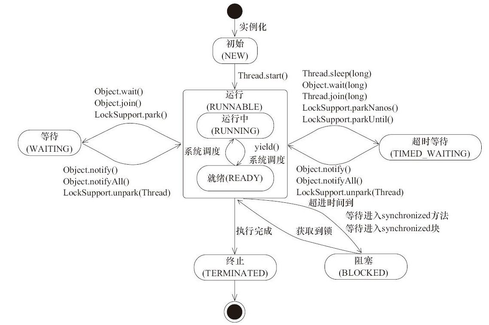

# 并发编程初探

## 天生的多线程

[6]Monitor Ctrl-Break（IDEA通过反射的方式，开启一个随着我们运行的jvm进程开启与关闭的一个监听线程）

[5]Attach Listener（附加监听器。jdk中一个工具类提供的**jvm线程之间通信的工具**（java -version、jstack、jmap、dump））开启我们这个线程的两个方式： 1. 通过jvm参数开启：-XX: StartAttachListener  2.延迟开启： cmd -- java -version -->  JVM 适时开启AL线程

[4]Signal Dispatcher（信号分发器。 我们通过cmd 发送jstack，传到了jvm进程，这时候信号分发器就要发挥作用了。）

[3]Finalizer（1. 只有当开始一轮垃圾收集的时候，才会开始调用finalize方法。 2.  daemon prio=10 高优先级的守护线程。  3. jvm在垃圾收集的时候，会将失去引用的对象封装到我们的 Fianlizer 对象（Reference）， 放入我们的 F-queue 队列中。由 Finalizer 线程执行inalize方法）

[2]Reference Handler（引用处理的线程。强，软，弱，虚。 -GC 有不同表现）

[1]main主线程

"main" #1 prio=5 os_prio=0 tid=0x00000000028f4800 nid=0x25ac waiting on condition [0x00000000028ef000] （操作系统面向的是JVM 进程，JVM 进程里面向的是 我们的main函数，。所以对于我们的操作系统如何看待我们的main函数优先级，无所谓。 只要os 给我们jvm进程足够公平的优先级就行。）

## 线程的优先级和守护线程

setPriority 这个方法，他是 jvm 提供的一个方法，并且能够调用 本地方法 setPriority0. 我们发现优先级貌似没有起作用，为什么？ 1. 我们现在的计算机都是多核的，t1，t2 会让哪个cpu处理不好说。由不同的cpu同时提供资源执行。 2. 优先级不代表先后顺序。哪怕你的优先级低，也是有可能先拿到我们的cpu时间片的，只不过这个时间片比高优先级的线程的时间片短。 优先级针对的是 cpu时间片的长短问题。 3. 目前工作中，实际项目里，不必要使用setPriority方法。我们现在都是用 hystrix， sential也好，一些开源的信号量控制工具，都能够实现线程资源的合理调度。这个 setPriority方法，很难控制。实际的运行环境太复杂。

```java
public final void setDaemon(boolean on) {
    checkAccess();
    if (isAlive()) {
		// 告诉我们，必须要先设置线程是否为守护线程，然后再调用start方法。如果你先调用start。 isAlive = true.
        throw new IllegalThreadStateException();
    }
    daemon = on;
}
```

## Stack log解读

```java
"BlockedThread-2" #15 prio=5 os_prio=0 tid=0x000000001b956000 nid=0x22d8 waiting for monitor entry [0x000000001d0be000] (发现死锁，一直不会释放的话)
   java.lang.Thread.State: BLOCKED (on object monitor)
        at com.boot.jdk.Blocked.run(ReadStackLog.java:45)
        - waiting to lock <0x00000000d67bca20> (a java.lang.Class for com.boot.jdk.Blocked)
        at java.lang.Thread.run(Thread.java:745)

"BlockedThread-1" #14 prio=5 os_prio=0 tid=0x000000001b955000 nid=0x4c4c waiting on condition [0x000000001cfbf000]
   java.lang.Thread.State: TIMED_WAITING (sleeping)
        at java.lang.Thread.sleep(Native Method)
        at com.boot.jdk.Blocked.run(ReadStackLog.java:45)
        - locked <0x00000000d67bca20> (a java.lang.Class for com.boot.jdk.Blocked)
        at java.lang.Thread.run(Thread.java:745)

"WaitingThread" #13 prio=5 os_prio=0 tid=0x000000001b954800 nid=0x39cc in Object.wait() [0x000000001cebf000]
   java.lang.Thread.State: WAITING (on object monitor)
        at java.lang.Object.wait(Native Method)
        - waiting on <0x00000000d67ba680> (a java.lang.Class for com.boot.jdk.Waiting)
        at java.lang.Object.wait(Object.java:502)
        at com.boot.jdk.Waiting.run(ReadStackLog.java:31)
        - locked <0x00000000d67ba680> (a java.lang.Class for com.boot.jdk.Waiting)
        at java.lang.Thread.run(Thread.java:745)

"TimeWaitingThread" #12 prio=5 os_prio=0 tid=0x000000001b951800 nid=0x3820 waiting on condition [0x000000001cdbe000]
   java.lang.Thread.State: TIMED_WAITING (sleeping)
        at java.lang.Thread.sleep(Native Method)
        at com.boot.jdk.TimeWaiting.run(ReadStackLog.java:20)
        at java.lang.Thread.run(Thread.java:745)
"Monitor Ctrl-Break" #6 daemon prio=5 os_prio=0 tid=0x000000001b6c9000 nid=0x1210 runnable [0x000000001c6be000]
   java.lang.Thread.State: RUNNABLE
        at java.net.SocketInputStream.socketRead0(Native Method)
        at java.net.SocketInputStream.socketRead(SocketInputStream.java:116)
        at java.net.SocketInputStream.read(SocketInputStream.java:170)
        at java.net.SocketInputStream.read(SocketInputStream.java:141)
        at sun.nio.cs.StreamDecoder.readBytes(StreamDecoder.java:284)
        at sun.nio.cs.StreamDecoder.implRead(StreamDecoder.java:326)
        at sun.nio.cs.StreamDecoder.read(StreamDecoder.java:178)
        - locked <0x00000000d67070b8> (a java.io.InputStreamReader)
        at java.io.InputStreamReader.read(InputStreamReader.java:184)
        at java.io.BufferedReader.fill(BufferedReader.java:161)
        at java.io.BufferedReader.readLine(BufferedReader.java:324)
        - locked <0x00000000d67070b8> (a java.io.InputStreamReader)
        at java.io.BufferedReader.readLine(BufferedReader.java:389)
        at com.intellij.rt.execution.application.AppMainV2$1.run(AppMainV2.java:64)

"Attach Listener" #5 daemon prio=5 os_prio=2 tid=0x000000001a72b000 nid=0x4ea8 waiting on condition [0x0000000000000000]
   java.lang.Thread.State: RUNNABLE

"Signal Dispatcher" #4 daemon prio=9 os_prio=2 tid=0x000000001a6d2800 nid=0x3d94 runnable [0x0000000000000000]
   java.lang.Thread.State: RUNNABLE

"Finalizer" #3 daemon prio=8 os_prio=1 tid=0x000000001a6b1800 nid=0x4254 in Object.wait() [0x000000001ab8f000] （只有进行垃圾收集的时候，才会被notify。 用到我们的 signal Dispatcher）
   java.lang.Thread.State: WAITING (on object monitor)
        at java.lang.Object.wait(Native Method)
        - waiting on <0x00000000d6108e98> (a java.lang.ref.ReferenceQueue$Lock)
        at java.lang.ref.ReferenceQueue.remove(ReferenceQueue.java:143)
        - locked <0x00000000d6108e98> (a java.lang.ref.ReferenceQueue$Lock)
        at java.lang.ref.ReferenceQueue.remove(ReferenceQueue.java:164)
        at java.lang.ref.Finalizer$FinalizerThread.run(Finalizer.java:209)

"Reference Handler" #2 daemon prio=10 os_prio=2 tid=0x00000000187c1000 nid=0x48a8 in Object.wait() [0x000000001a68f000] （引用处理线程。）
   java.lang.Thread.State: WAITING (on object monitor)
        at java.lang.Object.wait(Native Method)
        - waiting on <0x00000000d6106b40> (a java.lang.ref.Reference$Lock)
        at java.lang.Object.wait(Object.java:502)
        at java.lang.ref.Reference.tryHandlePending(Reference.java:191)
        - locked <0x00000000d6106b40> (a java.lang.ref.Reference$Lock)
        at java.lang.ref.Reference$ReferenceHandler.run(Reference.java:153)       
       
```

## 线程状态转换



Thread.start 之后，他会进入一个就绪状态，还没有分配到 cpu的执行权。 当cpu的时间片切换到他的时候，他才会开始执行，进入running状态。

BLOCKED:只针对我们的sync锁

Thread.join 方法，他底层代码调用的是 Object的 wait方法。那么想要唤醒join方法，就需要使用 object的notify以及 notifyall

## Thread源码解读-init和start方法

```java
Thread.init方法代码片段：
if (g == null) {
       if (security != null) {
        g = security.getThreadGroup();
    }
       if (g == null) {
        g = parent.getThreadGroup();
    }
}
尊重线程初始化传入的threadgroup；次选System security mananger 的 ThreadGroup；再次选 parent的 ThreadGroup。

g.addUnstarted(); // NEW状态的线程，会添加到ThreadGroup。
this.daemon = parent.isDaemon();
this.priority = parent.getPriority();
新的线程的属性依赖于 父类线程。

private static synchronized long nextThreadID() {
    return ++threadSeqNumber;
}
保证我们的tid的唯一性。

public synchronized void start() {}
避免多线程同时启动一个线程。IllegalThreadStateException

try {
// start0 完全执行完之前，线程处于 Ready
    start0();
// 完成后，只要cpu分配执行权，我们的线程就进入了Running状态。
    started = true;
}

try {
    if (!started) {
        group.threadStartFailed(this);
    }
} catch (Throwable ignore) {
    /* do nothing. If start0 threw a Throwable then
      it will be passed up the call stack */
Start0 这个异常，会直接反馈给我们的调用线程。
Main函数里边的 thread.start方法。 防止我们的 thread.start方法感知不到异常，导致程序的错误的继续执行。
}
```

一个新构造的线程对象是由其parent线程来进行空间分配的，而child线程继承了parent是否为Daemon、优先级和加载资源的contextClassLoader以及可继承的ThreadLocal，同时还会分配一个唯一的（sync）ID来标识这个child线程。至此，一个能够运行的线程对象就初始化好了，在堆内存中等待着运行。

线程对象在初始化完成之后，调用start()方法就可以启动这个线程。线程start()方法的含义是：当前线程（即parent线程）同步告知Java虚拟机，只要线程规划器空闲，应立即启动调用start()方法的线程。

## Thread源码解读-sleep和wait方法

```java
Thread.sleep
1.是否释放锁？ 不
Causes the currently executing thread to sleep (temporarily cease execution) for the specified number of milliseconds, subject to the precision and accuracy of system timers and schedulers. The thread does not lose ownership of any monitors.
2.是否对中断敏感？是
public static native void sleep(long millis) throws InterruptedException;
3.是否释放CPU？是
Object.wait
1.是否释放锁？ 是
The current thread must own this object's monitor. The thread releases ownership of this monitor and waits until another thread notifies threads waiting on this object's monitor to wake up either through a call to the notify method or the notifyAll method. The thread then waits until it can re-obtain ownership of the monitor and resumes execution.
2.是否对中断敏感？是
public final void wait() throws InterruptedException {
3.是否释放CPU？是
让出 CPU 时间片。进入等待队列。    
```

## Thread源码解读-join方法

```java
Thread.join
1.是否释放锁？ 具体要看当前的锁对象是谁。如果是调用join方法的锁对象，则释放。  
synchronized(obj){
    thread.join(); //join不释放锁
}
synchronized(thread){
    thread.join(); //join释放锁
}
2. 是否对中断敏感 ： 是
public final void join() throws InterruptedException {
3. 是否释放 CPU ：是的    
底层源码 调用的是 wait 方法。  
```

