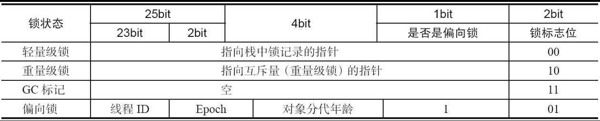

# Synchronized 全解读

## Synchronized的使用方法

```java
Classfile /C:/Users/wanghanhao/Desktop/JavaConcurrentProgramming/concurrent-01/target/classes/com/wanghanhao/concurrent/SyncUsingWay.class
  Last modified 2024年7月7日; size 795 bytes
  SHA-256 checksum 49191990699d00279537bf7ec2107e65bd4d0912f1e40e5a7e1be11ce36a77b4
  Compiled from "SyncUsingWay.java"
public class com.wanghanhao.concurrent.SyncUsingWay
  minor version: 0
  major version: 52
  flags: (0x0021) ACC_PUBLIC, ACC_SUPER
  this_class: #7                          // com/wanghanhao/concurrent/SyncUsingWay
  super_class: #8                         // java/lang/Object
  interfaces: 0, fields: 0, methods: 4, attributes: 1
Constant pool:
   #1 = Methodref          #8.#25         // java/lang/Object."<init>":()V
   #2 = Fieldref           #26.#27        // java/lang/System.out:Ljava/io/PrintStream;
   #3 = String             #16            // SyncMethod
   #4 = Methodref          #28.#29        // java/io/PrintStream.println:(Ljava/lang/String;)V
   #5 = String             #17            // StaticSyncMethod
   #6 = String             #18            // method
   #7 = Class              #30            // com/wanghanhao/concurrent/SyncUsingWay
   #8 = Class              #31            // java/lang/Object
   #9 = Utf8               <init>
  #10 = Utf8               ()V
  #11 = Utf8               Code
  #12 = Utf8               LineNumberTable
  #13 = Utf8               LocalVariableTable
  #14 = Utf8               this
  #15 = Utf8               Lcom/wanghanhao/concurrent/SyncUsingWay;
  #16 = Utf8               SyncMethod
  #17 = Utf8               StaticSyncMethod
  #18 = Utf8               method
  #19 = Utf8               StackMapTable
  #20 = Class              #30            // com/wanghanhao/concurrent/SyncUsingWay
  #21 = Class              #31            // java/lang/Object
  #22 = Class              #32            // java/lang/Throwable
  #23 = Utf8               SourceFile
  #24 = Utf8               SyncUsingWay.java
  #25 = NameAndType        #9:#10         // "<init>":()V
  #26 = Class              #33            // java/lang/System
  #27 = NameAndType        #34:#35        // out:Ljava/io/PrintStream;
  #28 = Class              #36            // java/io/PrintStream
  #29 = NameAndType        #37:#38        // println:(Ljava/lang/String;)V
  #30 = Utf8               com/wanghanhao/concurrent/SyncUsingWay
  #31 = Utf8               java/lang/Object
  #32 = Utf8               java/lang/Throwable
  #33 = Utf8               java/lang/System
  #34 = Utf8               out
  #35 = Utf8               Ljava/io/PrintStream;
  #36 = Utf8               java/io/PrintStream
  #37 = Utf8               println
  #38 = Utf8               (Ljava/lang/String;)V
{
  public com.wanghanhao.concurrent.SyncUsingWay();
    descriptor: ()V
    flags: (0x0001) ACC_PUBLIC
    Code:
      stack=1, locals=1, args_size=1
         0: aload_0
         1: invokespecial #1                  // Method java/lang/Object."<init>":()V
         4: return
      LineNumberTable:
        line 3: 0
      LocalVariableTable:
        Start  Length  Slot  Name   Signature
            0       5     0  this   Lcom/wanghanhao/concurrent/SyncUsingWay;

  public synchronized void SyncMethod();
    descriptor: ()V
    flags: (0x0021) ACC_PUBLIC, ACC_SYNCHRONIZED//锁标志
    Code:
      stack=2, locals=1, args_size=1
         0: getstatic     #2                  // Field java/lang/System.out:Ljava/io/PrintStream;
         3: ldc           #3                  // String SyncMethod
         5: invokevirtual #4                  // Method java/io/PrintStream.println:(Ljava/lang/String;)V
         8: return
      LineNumberTable:
        line 6: 0
        line 7: 8
      LocalVariableTable:
        Start  Length  Slot  Name   Signature
            0       9     0  this   Lcom/wanghanhao/concurrent/SyncUsingWay;

  public static synchronized void StaticSyncMethod();
    descriptor: ()V
    flags: (0x0029) ACC_PUBLIC, ACC_STATIC, ACC_SYNCHRONIZED//锁标志
    Code:
      stack=2, locals=0, args_size=0
         0: getstatic     #2                  // Field java/lang/System.out:Ljava/io/PrintStream;
         3: ldc           #5                  // String StaticSyncMethod
         5: invokevirtual #4                  // Method java/io/PrintStream.println:(Ljava/lang/String;)V
         8: return
      LineNumberTable:
        line 11: 0
        line 12: 8

  public void method();
    descriptor: ()V
    flags: (0x0001) ACC_PUBLIC
    Code:
      stack=2, locals=3, args_size=1
         0: aload_0
         1: dup
         2: astore_1
         3: monitorenter// 进入同步代码块（进入临界范围内，锁的原子内部）
         4: getstatic     #2                  // Field java/lang/System.out:Ljava/io/PrintStream;
         7: ldc           #6                  // String method
         9: invokevirtual #4                  // Method java/io/PrintStream.println:(Ljava/lang/String;)V
        12: aload_1
        13: monitorexit// 正常退出同步代码块
        14: goto          22
        17: astore_2
        18: aload_1
        19: monitorexit//防止任何异常情况下，退出同步代码块。JVM 仍然可以释放锁
        20: aload_2
        21: athrow
        22: return
      Exception table: //配合来了异常退出 monitorexit
         from    to  target type
             4    14    17   any
            17    20    17   any
      LineNumberTable:
        line 16: 0
        line 17: 4
        line 18: 12
        line 19: 22
      LocalVariableTable:
        Start  Length  Slot  Name   Signature
            0      23     0  this   Lcom/wanghanhao/concurrent/SyncUsingWay;
      StackMapTable: number_of_entries = 2
        frame_type = 255 /* full_frame */
          offset_delta = 17
          locals = [ class com/wanghanhao/concurrent/SyncUsingWay, class java/lang/Object ]
          stack = [ class java/lang/Throwable ]
        frame_type = 250 /* chop */
          offset_delta = 4
}
SourceFile: "SyncUsingWay.java"
```

## Synchronized 的特性及对象头

1. 有序性 （读读、读写、写读、写写 互斥）
2. 可见性 （可见性是指多个线程访问⼀个资源时，该资源的状态、值信息等对于其他线程都是可见的。 synchronized和volatile都具有可见性，其中synchronized对⼀个类或对象加锁时，⼀个线程如果要访问该类或对象必须先获得它的锁，⽽这个锁的状态对于其他任何线程都是可见的，并且在释放锁之前会将对变量的修改刷新到共享内存当中，保证资源变量的可见性。）
3. 原子性 (本质上是线程互斥保证的原子性)
4. 可重入性




## Synchronized锁升级-偏向锁

偏向锁使用的前提：

1. 至少JDK1.6 版本且开启了偏向锁配置。偏向锁在Java 6和Java 7里是默认启用的，但是它在应用程序启动几秒钟之后才激活，如有必要可以使用JVM参数来关闭延迟：-XX:BiasedLockingStartupDelay=0。如果你确定应用程序里所有的锁通常情况下处于竞争状态，可以通过JVM参数关闭偏向锁：-XX:-UseBiasedLocking=false，那么程序默认会进入轻量级锁状态。

2. 被加锁的对象，没有真正、或者隐式的调用父类 Object 里边的hashcode方法。（如果一旦调用了object的hashcode方法，那么我们的对象头里边就有真正的hashcode值了，如果偏向锁来进行markword的替换，至少要提供一个保存hashcode的地方吧？可惜的是，偏向锁并没有地方进行markword的保存，只有轻量级锁才会有“displace mark word”）

为了让线程获得锁的代价更低而引入了偏向锁。当一个线程访问同步块并获取锁时，会在对象头和栈帧中的锁记录里（对象头：存储线程id和栈帧中的锁记录里： 线程有自己的栈帧，LOCK RECORD: 存储当前线程id）存储锁偏向的线程ID，以后该线程在进入和退出同步块时不需要进行CAS操作来加锁和解锁，只需简单地测试一下对象头的Mark Word里是否存储着指向当前线程的偏向锁（id的匹配）。如果测试成功，表示线程已经获得了锁。如果测试失败，则需要再测试一下Mark Word中偏向锁的标识是否设置成1（表示当前是偏向锁）：如果没有设置，则使用CAS竞争锁；如果设置了，则尝试使用CAS将对象头的偏向锁指向当前线程（其实是cas竞争替换 线程id）。

## Synchronized锁升级 - 轻量级锁加锁与解锁

轻量级锁加锁

线程在执行同步块之前，JVM会先在当前线程的栈桢中创建用于存储锁记录的空间（Lock Record记录），并将对象头中的Mark Word（前30位 （25位的hashcode，4位的分代年龄，1位是否为偏向锁））复制到锁记录中，官方称为Displaced Mark Word。然后线程尝试使用CAS将对象头中的Mark Word替换为指向锁记录的指针（指向线程栈帧里边的Lock Record的指针）。如果成功，当前线程获得锁，如果失败，表示其他线程竞争锁，当前线程便尝试使用自旋来获取锁。

轻量级锁解锁

轻量级解锁时，会使用原子的CAS操作将Displaced Mark Word（Lock Record记录）替换回到对象头，如果成功，则表示没有竞争发生。如果失败，表示当前锁存在竞争，锁就会膨胀成重量级锁。

真正的锁升级，是依赖于 class 的，而并不是依赖于 某一个 new出来的对象（偏向锁升级为轻量级锁）。

真正的锁升级，是依赖于 当前new出来的对象的（轻量级锁升级为重量级锁）。

轻量级锁升级为重量级锁：这个时候，只要我们的线程发生了竞争，并且CAS替换失败，就会发起锁膨胀，升级为重量级锁（针对的是一个对象实例）。

## Synchronized 锁升级 - 轻量级锁升级为重量级锁


轻量级锁---重量级锁： 释放锁（前四步）并唤醒等待线程

1. 线程1 初始化monitor 对象；
2. 将状态设置为膨胀中（inflating）；
3. 将monitor里边的header属性，set称为对象的markword；（将自己lock record里边的存放的mark word的hashcode，分代年龄，是否为偏向锁 set 到 objectmonitor对象的header属性里）
4. 设置对象头为重量级锁状态（标记为改为00）；然后将前30位指向第1不他初始化的monitor 对象；（真正的锁升级是由线程1操控的）
5. 唤醒线程2；

线程2 开始争抢重量级锁。（线程2就干了一件事儿，就是弄了一个临时的重量级锁指针吧？还不是最后的重量级锁指针。因为最后的重量级锁指针是线程1初始化的并且是线程1修改的。 而且，线程2被唤醒之后，还不一定能够抢到这个重量级锁。Sync是非公平锁。 线程2费力不讨好，但是线程2做了一件伟大的事情：他是锁升级的奠基者。）
